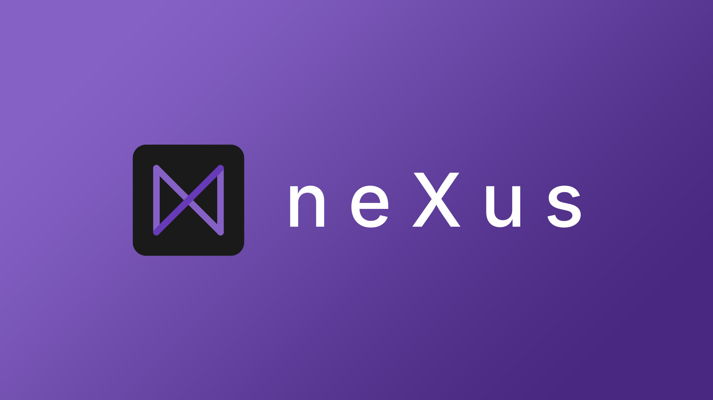

# nuXus - The custom tournament HUD for LOL.



# neXusについて

neXusはOBSなどの配信アプリケーションで使えるリーグ・オブ・レジェンドのカスタムHUDを提供します。大会や配信などでご自由にご利用ください。

nuXusは現在日本語にのみ対応しています。
nuXus currently supports only Japanese.

## インストール

現在、nuXusはWindowsでのみ利用可能です。

| バージョン | インストーラー                                                                                                        | ZIP ファイル                                                                                              |
| ---------- | --------------------------------------------------------------------------------------------------------------------- | --------------------------------------------------------------------------------------------------------- |
| Latest     | [windows-x64-nexus-setup.exe](https://github.com/n-soukun/nexus/releases/latest/download/windows-x64-nexus-setup.exe) | [windows-x64-nexus.zip](https://github.com/n-soukun/nexus/releases/latest/download/windows-x64-nexus.zip) |
| v0.0.1     | [windows-x64-nexus-setup.exe](https://github.com/n-soukun/nexus/releases/download/v0.0.1/windows-x64-nexus-setup.exe) | [windows-x64-nexus.zip](https://github.com/n-soukun/nexus/releases/download/v0.0.1/windows-x64-nexus.zip) |

## テーマについて

デフォルトでは、テーマ開発用のテンプレートのようなものが入っています。すぐに動くテーマを試したい場合は、[Metal](https://github.com/n-soukun/nexus-metal)などの配布されているテーマを使ってください。

> 重要：テーマフォルダー内のファイルはすべてhttpサーバーによって配信されます。 ダウンロードしたテーマの導入には十分注意してください。また、自作する場合はテーマにプライベートな情報を含めないようにご注意ください。

### テーマの開発

nuXusのテーマの実態はWebsocketクライアントを搭載したHTMLファイルです。`HTML` + `CSS` + `JavaScript` によって開発することができます。

#### テーマのフォーマット

nuXusは以下のファイルが含まれるZipファイルをテーマとして認識します。

```
📦theme.zip
 ┣ 📜index.html
 ┗ 📜manifest.json
```

以下のようにCSSやJavaScriptを分割しても大丈夫です。

```
📦theme.zip
 ┣ 📂img
 ┣ 📜index.html
 ┣ 📜manifest.json
 ┣ 📜script.js
 ┣ 📜style.css
 ┗ 📜thumbnail.jpg
```

manifest.jsonは以下のようなフォーマットです。

```json
{
    "manifestVersion": 1,
    "themeId": "com.example.default", // 他のテーマと被らずフォルダ名として使える文字列
    "name": "Default",
    "description": "A basic theme for the HUD",
    "thumbnail": "thumbnail.jpg",
    "width": 1160,
    "height": 119,
    "version": "1.0.0",
    "author": "Your Name",
    "authorUrl": "https://yourwebsite.com",
    "website": "https://yourwebsite.com/basic-theme",
    "license": "MIT",
    "licenseUrl": "https://opensource.org/licenses/MIT"
}
```

#### Websocketによる通信について

通信の内容についてはデフォルトテーマや [websocket.ts](./packages/desktop-client/src/main/websocket.ts)を参考にしてください。通信内容はメジャーバージョン内において後方互換性があります。

## ライセンス

MIT (詳細は `License` を参照)
